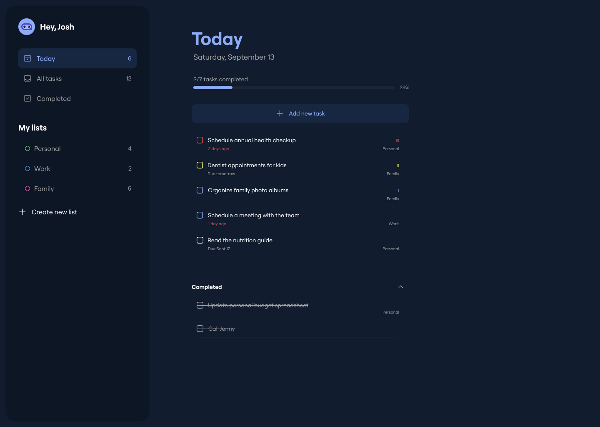
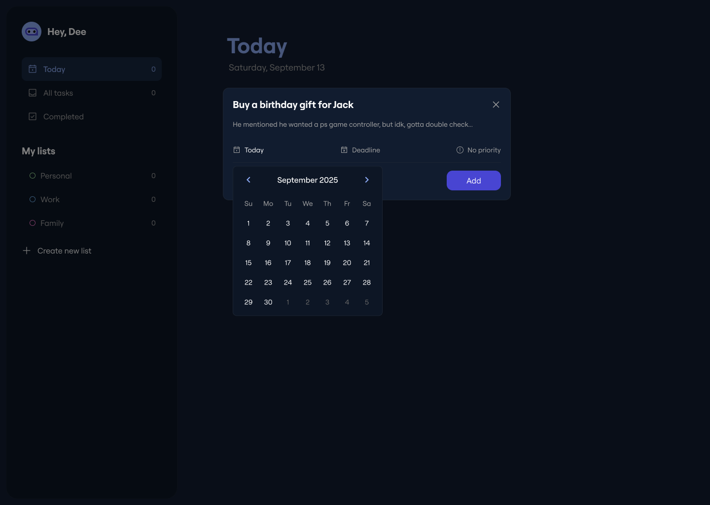

# Enso — TypeScript Task Management App

A task-focused productivity app built with **TypeScript**, **Webpack**, and a layered architecture that separates domain logic, services, infrastructure, and UI rendering.

The app supports day-to-day planning with task creation, editing, completion tracking, custom lists, date-based scheduling, and persistent local storage.

**Live demo:** https://enso-task-manager.netlify.app/
**Issues:** https://github.com/dee-diaz/enso-app/issues




---

## Table of Contents

- [Features](#features)
- [Tech Stack](#tech-stack)
- [Architecture](#architecture)
- [Project Structure](#project-structure)
- [Local Setup](#local-setup)
- [Available Scripts](#available-scripts)
- [How Data Persistence Works](#how-data-persistence-works)
- [Code Quality](#code-quality)
- [Future Improvements](#future-improvements)

---

## Features

### Task Management

- Create tasks with title, description, schedule date, deadline date, and priority
- Edit existing tasks in a modal-based workflow
- Delete tasks from the task editor
- Toggle completion with checkbox interactions

### Smart List Views

- Default lists: **Today**, **All tasks**, and **Completed**
- Automatic “Today” assignment when a task is scheduled for the current date
- Completion list behavior separated from active task lists
- Sidebar counters for each list

### Custom Organization

- Create custom lists from the sidebar
- Assign tasks to custom lists
- Seeded starter custom lists on first load (Personal, Family, Work)

### UX Enhancements

- First-run onboarding modal with optional user name
- Priority and list dropdown pickers in the task form
- Date picker integration for schedule/deadline fields
- Mobile sidebar toggle behavior

---

## Tech Stack

### Core

- **TypeScript**
- **Webpack 5**
- **CSS**

### Tooling

- **ESLint**
- **Prettier**
- **ts-loader**

### Libraries

- **date-fns**
- **air-datepicker**

---

## Architecture

The codebase uses a layered design to keep business logic isolated from rendering concerns.

### Domain Layer

- `Task`, `List` entities
- `TaskManager` and `ListManager` for core CRUD/business rules

### Services Layer

- `FilterService` for list-based task filtering
- `SortingService` for priority ordering
- `ValidationService` for form input validation

### Infrastructure Layer

- `StorageInterface` abstraction
- `LocalStorageAdapter` implementation for browser persistence

### Presentation Layer

- Dedicated renderers (`SidebarRenderer`, `TaskRenderer`, `ModalRenderer`)
- Dedicated handlers (`FormHandler`, `ModalHandler`)
- UI components for date picker and dropdown behavior

This separation improves maintainability and makes logic easier to extend and test.

---

## Project Structure

```bash
enso-app/
├── src/
│   ├── domain/
│   ├── infrastructure/
│   ├── presentation/
│   │   ├── components/
│   │   ├── handlers/
│   │   └── renderers/
│   ├── services/
│   ├── types/
│   ├── utils/
│   ├── App.ts
│   ├── index.ts
│   └── style.css
├── webpack.common.js
├── webpack.dev.js
├── webpack.prod.js
└── package.json
```

---

## Local Setup

### Prerequisites

- Node.js 18+ (Node 20+ recommended)
- npm

### 1) Clone and install

```bash
git clone https://github.com/dee-diaz/enso-app.git
cd enso-app
npm install
```

### 2) Run development server

```bash
npm run dev
```

### 3) Build for production

```bash
npm run build
```

The production bundle is generated in `dist/`.

---

## Available Scripts

```bash
npm run dev      # start webpack dev server
npm run build    # create production bundle
npm run lint     # run ESLint checks
npm run deploy   # push dist/ to gh-pages using git subtree
```

---

## How Data Persistence Works

The app persists key data in `localStorage`:

- `tasks` for all task entries
- `lists` for user-created custom lists
- `user-name` for onboarding personalization

On startup, the app hydrates these values, initializes seeded lists when needed, and updates dynamic list memberships (for example, re-evaluating “Today” tasks).

---

## Code Quality

- TypeScript types are used across domain, services, and UI orchestration
- ESLint is configured for consistency and maintainability
- Logic is decomposed into focused classes and modules to reduce coupling
